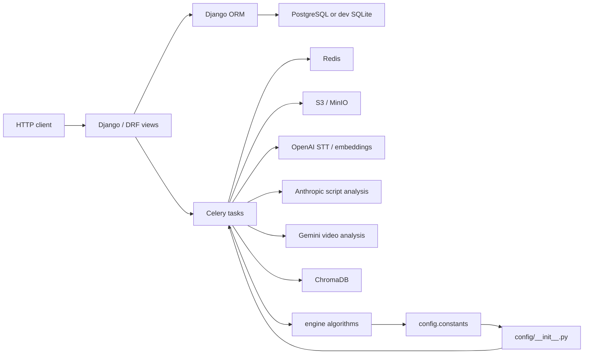
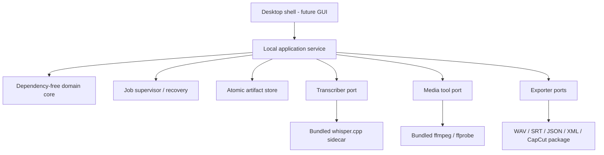

# Dependency map

## 1. Current runtime topology



Evidence:

- `requirements.txt:1-20` lists the combined web, queue, database, storage, cloud AI, and vector stack.
- `docker-compose.yml:1-91` starts web, worker, beat, Redis, PostgreSQL, and MinIO.
- `apps/projects/tasks.py:24-57` imports Celery, Django settings/models, Anthropic, engine modules, and S3 into one orchestration module.

This topology must not be embedded in a desktop application.

## 2. Hidden import-time coupling

The most important dependency defect is:

```text
engine.processing.script
  -> config.constants
     -> package import config/__init__.py
        -> config.celery
           -> Celery + DJANGO_SETTINGS_MODULE + Django settings
```

- `config/__init__.py:1` imports the global Celery app unconditionally.
- `config/celery.py:3-9` creates the app and initializes Django-backed configuration.
- `config/settings/base.py:18-20,79-91,182-189` reads `.env` and requires server/database/storage values during import.

Consequences:

- a nominally pure subtitle function cannot be imported without Celery;
- test isolation depends on a Django environment even for many engine tests;
- configuration is ambient global state rather than explicit input;
- extracting a module by copying its import statement is unsafe.

The new core must use inert packages and explicit immutable configuration values. Package `__init__` files must have no runtime side effects.

## 3. Module classification

| Module/group | Current dependencies | Relevance | Decision |
|---|---|---:|---|
| `engine/alignment/align.py` | stdlib | High | Port concepts and fixtures; rewrite Unicode/global alignment |
| `engine/processing/script.py` | stdlib + hidden `config`/Celery | High | Extract only deterministic ideas/constants |
| `engine/export/timing.py` | stdlib | Medium | Reuse clamp concept; replace frame-first core |
| `engine/export/fcpxml.py` | stdlib | High | Use as reference; rewrite audio-first adapter |
| `engine/export/premiere_xml.py` | stdlib | High | Use as reference; rewrite audio-first adapter |
| `engine/cleaning/cleaner.py` | subprocess + hidden `config`/Celery | Low/medium | Reuse process/progress pattern only |
| `engine/processing/transcribe.py` | OpenAI SDK/network | Low | Replace completely with local port/adapter |
| `engine/llm/**` | OpenAI/Gemini | None | Drop |
| `engine/footage/**` | Chroma + B-roll domain | None | Drop |
| `engine/processing/{blocks,blueprint,classify,sections}.py` | injected LLM + B-roll taxonomy | None | Drop from product scope |
| `apps/**` | Django/DRF/Celery/ORM | None | Do not migrate |
| `storage/s3.py` | boto3 + Django settings | None | Replace with local filesystem artifact store |
| `config/**` | Django/Celery/env globals | None | Do not migrate |
| migrations | Django ORM | None | Do not migrate |
| Docker/Gunicorn/WSGI/ASGI | server runtime | None | Do not migrate |

## 4. Current data dependency flow

```text
Project.voiceover_s3_key
  -> S3 download to temporary MP3
  -> optional cloud STT
  -> cloud LLM script processing
  -> cloud embedding + Chroma B-roll lookup
  -> beat-level alignment when STT actually ran
  -> Django Segment rows
  -> S3 media download
  -> XML/ZIP generation
  -> S3 upload + presigned URLs
```

Critical breaks for the target product:

- a supplied script prevents STT word timestamp generation (`apps/projects/tasks.py:366-376`);
- word timestamps are memory-only (`apps/projects/tasks.py:356,376`);
- only beat-level frames are persisted (`apps/projects/models.py:41-60`);
- the export packages the original MP3 rather than a cleaned WAV (`apps/projects/tasks.py:831-909`);
- there is no edit-map transform.

## 5. Existing production dependencies

| Dependency | Current role | Target disposition |
|---|---|---|
| Django, DRF, JWT, CORS, WhiteNoise, Gunicorn | Multi-user HTTP backend | Remove |
| Celery, Redis | Distributed jobs | Replace with local supervisor/state machine |
| psycopg/PostgreSQL | SaaS persistence | Remove; evaluate SQLite only for local job history |
| boto3, MinIO/S3 | Object storage | Replace with typed local paths and atomic filesystem writes |
| OpenAI | Cloud STT and embeddings | Remove from processing path |
| Anthropic | Script/B-roll analysis | Remove |
| Gemini | Video analysis | Remove |
| ChromaDB/PostHog | Vector retrieval/telemetry dependency | Remove |
| FFmpeg from system package/PATH | Media probe/transcode | Bundle pinned LGPL-compatible executables |

No new dependency is added by this planning work.

## 6. Proposed dependency direction



Dependency rule: adapters depend on domain contracts; the domain must never import desktop UI, filesystem implementation, subprocess implementation, Tauri, FFmpeg, whisper.cpp, databases, or editor-specific serializers.

## 7. Proposed ports

| Port | Input | Output | Adapter |
|---|---|---|---|
| `AudioProbe` | local path | `AudioInfo` | bundled ffprobe |
| `AudioDecoder` | source + canonical format | streaming PCM | bundled FFmpeg |
| `Transcriber` | canonical audio + language/config | `TranscriptionResult` | whisper.cpp wrapper |
| `ScriptAligner` | exact script tokens + ASR words | `AlignmentResult` | domain implementation |
| `SilenceDetector` | PCM + policy | candidate spans | domain/signal adapter |
| `PausePlanner` | candidates + protected words | `EditMap` | domain implementation |
| `AudioRenderer` | source + edit map | cleaned WAV/report | FFmpeg adapter or native WAV writer |
| `SubtitleChunker` | timed original tokens | cues | domain implementation |
| `ArtifactStore` | staged artifacts | atomically published directory | local filesystem |
| `JobStore` | job state transitions | durable records | JSON or SQLite adapter |
| `ProgressSink` | stage events | UI/CLI events | application adapter |
| `CancellationToken` | user/system request | cooperative/process cancellation | supervisor adapter |
| `ModelRepository` | model request | verified local model | bundle/cache adapter |

## 8. Canonical domain records

- `AudioInfo`: sample rate, channel count, sample format, total samples, hashes, source metadata.
- `ASRWord`: recognized text, normalized variants, source sample range, confidence, model provenance.
- `ScriptToken`: exact source character range, exact text, normalized variants, token kind.
- `TokenAlignment`: script/ASR ranges, status, score, ambiguity/provenance.
- `EditSpan`: source/output half-open sample ranges and operation.
- `RemovedSpan`: detected pause, removed middle, retained pause, guards, reason.
- `TimedToken`: original text with cleaned sample range and alignment status.
- `SubtitleCue`: exact script range, lines, cleaned range, warnings.
- `TimelineIR`: cleaned audio asset, rational frame rate, subtitle cues, package-relative paths.
- `ArtifactManifest`: schemas, paths, hashes, sizes, versions, warnings.
- `JobRecord`: state, stage, progress, cancellation, checkpoints, sanitized error, input/output fingerprints.

## 9. Local persistence decision

Recommended split:

- versioned JSON artifacts (`edit_map.json`, manifest, alignment report) are the portable source of truth;
- a small local SQLite database may store job history and recovery state, but is not required for the first headless vertical slice;
- every job has a UUID workspace with `job.json`, stage checkpoints, and `.partial` outputs;
- final publication is staging -> validate -> atomic rename;
- no user/brand/project foreign-key graph is needed.

## 10. Dependency isolation gates

The new repository must include automated checks that:

1. the domain core imports with Django, Celery, boto3, cloud SDKs, and Tauri absent;
2. forbidden import prefixes cannot appear in core modules;
3. processing succeeds with network egress blocked;
4. bundled tools are resolved by an absolute bundle path and processing works with an empty `PATH`;
5. configuration is supplied explicitly and no `.env` is read during core import;
6. artifact writes are atomic and crash-safe;
7. reference files remain immutable.

## 11. Extraction sequence

1. Freeze hashes and provenance of the reference inputs.
2. Convert selected reference tests into characterization/golden fixtures.
3. Create a separate core skeleton with architecture rules.
4. Define sample-based DTOs and schema versions before adapters.
5. Port only selected pure concepts, removing `config` imports.
6. Implement the pipeline against fake media/STT adapters.
7. Add local FFmpeg and STT adapters only after runtime/model/license decisions.
8. Add XML/SRT/CapCut adapters from the shared canonical cue/timeline model.
9. Add desktop shell only after the headless local pipeline is deterministic and recoverable.
