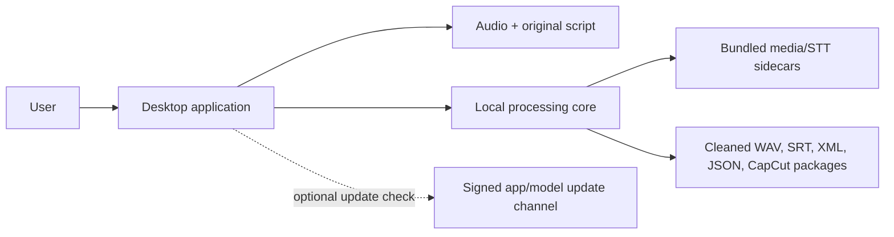
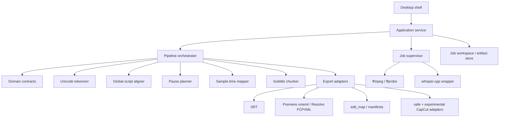

# Proposed architecture

## 1. Recommendation

Build a new audio-first desktop product around:

- a Tauri 2 desktop shell;
- a Rust application service, job supervisor, and dependency-free domain core;
- separate signed sidecars for `ffmpeg`, `ffprobe`, and a thin whisper.cpp wrapper;
- a versioned local model pack;
- project/job workspaces on the local filesystem;
- versioned JSON contracts as the portable source of truth;
- no local HTTP server, Django, Celery, Redis, PostgreSQL, MinIO, cloud AI provider, or system Python.

Tauri explicitly supports target-specific bundled external binaries, including Python or other executables, so it can ship native sidecars without user installation ([Tauri sidecars](https://v2.tauri.app/develop/sidecar/)). A Python `onedir` sidecar remains a viable short-lived comparison spike, but the recommended production core is Rust because most target functionality does not exist in the Python reference and would have to be written anew anyway.

This document is architectural only. It does not add Tauri, Rust, FFmpeg, whisper.cpp, a model, or any other production dependency.

## 2. Goals and non-goals

### Goals

- Windows x64 and macOS arm64/x86_64 standalone installation.
- Local-only media processing.
- No user-installed Python, FFmpeg, library, or model.
- Conservative pause shortening that never intentionally cuts protected speech.
- Exact preservation of original script spelling, case, and punctuation.
- One canonical time model used by WAV, word timestamps, subtitles, XML, and edit map.
- Deterministic, recoverable, cancelable jobs.
- Portable outputs with no absolute user paths.
- Safe standards-based CapCut package as the default.

### Non-goals for the first implementation phase

- Reusing the Django application or its database schema.
- B-roll matching, brands, winners, corrections, embeddings, or cloud LLM classification.
- GUI implementation before a headless end-to-end pipeline is stable.
- Writing into an existing CapCut draft.
- Embedding subtitle styling as the authoritative source in editor XML.

## 3. Context diagram



The processing path has no network edge. Update checks are separate, optional, disabled during active jobs, and not required after installation.

## 4. Component architecture



## 5. Canonical pipeline

```text
1. Validate input paths, formats, free disk, and output destination.
2. Probe input with bundled ffprobe.
3. Decode/stream to canonical PCM for analysis.
4. Run local STT on the original audio and collect word-level source timings.
5. Tokenize the immutable original script with Unicode character spans.
6. Globally align script tokens to ASR words; record omissions/insertions/repeats.
7. Detect candidate pauses from audio energy/silence and inter-word gaps.
8. Protect all aligned speech with configurable pre/post guards.
9. Shorten only the middle of eligible long pauses; produce sample-accurate EditMap.
10. Render cleaned_audio.wav into staging.
11. Probe and validate the rendered WAV.
12. Remap words and aligned script tokens from source to cleaned sample positions.
13. Build readable SubtitleCue records from original script spans.
14. Render subtitles.srt, premiere.xml, resolve.fcpxml, edit_map.json.
15. Build safe CapCut package; optionally build an experimental new draft.
16. Hash, validate, write manifest, then atomically publish outputs.
```

Transcription should run on original audio before cleaning. Cleaned audio may be transcribed again only as optional QA; it must never replace original display text.

## 6. Time model

Canonical time is an integer sample index at the canonical sample rate. All ranges are half-open `[start,end)`.

Required invariants:

- source spans are ordered and non-overlapping;
- kept plus removed spans partition the source analysis range;
- output kept spans are gapless;
- output duration equals the sum of kept source lengths plus explicitly rendered transitions;
- no removal overlaps a protected word interval plus guard;
- every mapped output time is monotonic;
- final output end equals the actual WAV sample count.

Seconds, SRT milliseconds, and editor frames are derived values. Frame rates are rational `{num,den}`, not integer-only. Export quantization must use named integer policies; implicit floating-point `round()` is forbidden.

## 7. Pause safety model

A long pause is eligible only when all conditions pass:

1. its measured duration exceeds the configured threshold;
2. signal analysis marks the removable middle as silence/low energy;
3. the span lies between protected words or inside explicit leading/trailing policy;
4. the removal does not intersect pre/post word guards;
5. a configurable natural pause remains;
6. the cut boundary passes a local waveform/VAD safety check;
7. alignment confidence is above the required threshold.

On uncertainty, default behavior is `no-cut + warning`. Leading and trailing silence should be preserved by default unless the user enables a separate trim policy.

Each removal record stores the detected pause, removed middle, retained pause, energy metrics, guards, decision reason, and policy version.

## 8. Script and alignment model

Display text always comes from exact source character spans. Normalization is a parallel view used only for matching.

The aligner should support:

- Unicode and locale-aware tokenization;
- many-to-many matches (`2026` vs spoken words);
- insertion, omission, substitution, repetition, and ambiguous repeated phrases;
- global monotonic optimization rather than a local greedy cursor;
- confidence and provenance per alignment operation;
- bounded interpolation that is explicitly labeled and never treated as observed timing.

Default mismatch policy:

- omitted script tokens are not shown in SRT and are reported;
- ASR-only insertions do not alter displayed script text;
- repeated speech is reported; the original token is not silently duplicated;
- low-confidence regions prevent automatic cuts around them.

## 9. Subtitle architecture

`SubtitleCue` is the single source for SRT and any optional editor titles. Exporters must not repartition text or distribute time evenly.

Chunking inputs:

- exact timed script tokens;
- original paragraphs and punctuation;
- source pause metadata retained across cleaning;
- locale;
- line/character/word limits;
- target and hard maximum characters per second;
- minimum/maximum cue duration and gap.

A deterministic global optimizer should prefer sentence, paragraph, pause, clause punctuation, and locale conjunction boundaries while avoiding splits inside numbers, units, abbreviations, URLs, emails, and lexical compounds. Impossible constraints produce warnings in the cue rather than silent data loss.

## 10. Artifact contracts

### Required output directory

```text
output/
  cleaned_audio.wav
  subtitles.srt
  premiere.xml
  resolve.fcpxml
  edit_map.json
  manifest.json
  checksums.sha256
  capcut_safe/
    cleaned_audio.wav
    subtitles.srt
    edit_map.json
    manifest.json
    README.txt
  capcut_draft/           # only when explicitly enabled and supported
```

### `edit_map.json` v1

Minimum fields:

- `schema_version` and pipeline version;
- source/output audio metadata and SHA-256;
- canonical sample rate and total sample counts;
- ordered kept and removed spans;
- retained-pause and transition metadata;
- cleaning policy snapshot;
- local STT model/runtime identity;
- alignment coverage/status summary;
- source and cleaned word timings with provenance;
- warnings and degraded-mode flags;
- no absolute paths.

### `TimelineIR`

- project name;
- cleaned WAV relative path/hash/format/duration;
- rational frame rate and drop-frame policy;
- canonical `SubtitleCue` list;
- optional editor preset/profile;
- no B-roll clip IDs or Django entities.

## 11. Editor exports

### Premiere

- Output `premiere.xml` as FCP7 XML/xmeml.
- Use actual WAV sample rate, channels, bit depth, and duration.
- Use rational-rate policy mapped explicitly to xmeml `timebase`/`ntsc`.
- Reference only portable package-relative media paths.
- Reject missing, overlapping, or nonmonotonic timing.

### Resolve / Final Cut

- Output `resolve.fcpxml` after an import spike selects the tested FCPXML version and audio-only structure.
- Validate against the official DTD and real Resolve imports. Apple notes DTD validity alone does not guarantee successful import ([Apple FCPXML reference](https://developer.apple.com/documentation/professional-video-applications/fcpxml-reference)).
- Prefer a single cleaned audio asset at time zero.

### Subtitles

`subtitles.srt` is authoritative. XML titles/captions are an optional compatibility profile because title generators are not equivalent to editor caption tracks.

## 12. CapCut safety model

### Safe package

- Contains only standards-based files and instructions.
- Never discovers or writes CapCut application directories.
- Relies on CapCut Desktop's documented external SRT import.
- Is deterministic and portable.

### Experimental draft

- Separate feature flag and warning.
- Allowlisted CapCut platform/version/schema fingerprint only.
- Creates a new draft/copy; never edits an existing draft in place.
- Uses staging, backup, atomic publish, and disposable-profile tests.
- Fails closed on unknown versions or missing integrity rules.
- Is not a release blocker for the safe package.

## 13. Job execution, cancellation, and recovery

Recommended job states:

```text
queued -> running -> succeeded
                 -> failed
                 -> cancelled
                 -> interrupted -> resumable | cleanable | corrupt
```

- Sidecars run in owned process trees: Windows Job Object, macOS process group.
- Progress is machine-readable, not scraped from localized console text.
- Cancellation stops the tree, waits a bounded grace period, records state, and removes only rebuildable partials.
- A job workspace persists UUID, request/config hashes, tool/model versions, stage checkpoints, warnings, and `.partial` files.
- Startup recovery scans interrupted workspaces and never deletes source or final exports automatically.

## 14. Runtime and distribution

### Recommended supported targets for v1

- Windows x64;
- macOS arm64;
- macOS x86_64.

Windows ARM64 remains experimental until benchmark and release infrastructure exist. Separate macOS DMGs are preferred initially to avoid duplicating native payload in a universal package.

### Bundled tools and model

- Pinned, reproducible FFmpeg/ffprobe builds without GPL/nonfree flags or libx264; audio-only target does not need libx264.
- Pinned whisper.cpp wrapper binaries per target.
- Baseline multilingual model bundled if installation must be fully offline; otherwise a signed/hash-verified first-run pack is permissible only if the product promise is "local processing" rather than "offline installation".
- `base` is a candidate, not a decision. Choose via an ElevenLabs corpus benchmark.

whisper.cpp publishes platform-oriented C/C++ inference and model inventory suitable for local deployment ([whisper.cpp](https://github.com/ggml-org/whisper.cpp)).

### Signing

- macOS: sign nested components inside-out, Hardened Runtime, Developer ID, notarization, staple, Gatekeeper clean-room smoke. Apple recommends Developer ID signing and notarization for software distributed outside the Mac App Store ([Apple distribution](https://developer.apple.com/macos/distribution/)).
- Windows: sign and timestamp sidecars, main executable, installer, and update artifacts. A production MSIX must be signed and trusted ([Microsoft MSIX signing](https://learn.microsoft.com/en-us/windows/msix/package/signing-package-overview)); the initial consumer channel may instead use a signed per-user NSIS installer, with MSI later for enterprise.

### Licensing and supply chain

FFmpeg is LGPL by default but becomes GPL when GPL components are enabled; the project's own checklist calls out libx264 as GPL ([FFmpeg legal](https://ffmpeg.org/legal.html)). Ship exact source/build recipe, notices, hashes, license metadata, and an SPDX/CycloneDX SBOM. Confirm rights to reuse the reference repository before copying code because no repository license was found.

## 15. Privacy and offline acceptance

- Main processing succeeds with network egress blocked.
- No telemetry, cloud crash reporting, or analytics in the processing path.
- Updates/model checks are separate and disableable.
- Default logs exclude script content, recognized words, filenames, and absolute paths.
- Crash report attachment is opt-in and sanitized.
- Shell permissions allow only known bundled sidecars.
- User paths are argv values, never interpolated shell strings.
- Mutable model/job/cache data lives in OS application-data locations; installed resources are immutable.

## 16. Proposed repository layout

```text
apps/desktop/                    # future Tauri shell; no GUI work in current phase
crates/domain/                   # dependency-free contracts and algorithms
crates/pipeline/                 # application orchestration
crates/runtime/                  # process, paths, resources, cancellation
crates/media/                    # ffprobe/ffmpeg adapters
crates/stt/                      # local transcriber adapter
crates/subtitles/                # chunking and SRT
crates/export/                   # edit map, xmeml, FCPXML, packages
crates/jobs/                     # durable state/recovery
distribution/                   # pinned binaries, manifests, notices, SBOM recipes
schemas/                         # versioned JSON schemas
tests/fixtures/                  # synthetic and licensed real fixtures
tests/golden/                    # deterministic artifact goldens
tests/integration/               # headless, package, NLE, privacy
docs/adr/                        # decisions and compatibility matrices
```

## 17. Required ADRs before implementation

1. Tauri/Rust production core vs permanent Python sidecar.
2. whisper.cpp wrapper process vs in-process library.
3. Supported OS versions and architectures.
4. Baseline model, languages, quality/latency thresholds, and delivery policy.
5. Canonical PCM/WAV format and sample rate.
6. Pause threshold, retained pause, speech guards, breath policy, and leading/trailing trim policy.
7. Low-confidence alignment behavior and mismatch policies.
8. `edit_map.json` v1 schema and compatibility policy.
9. Supported rational frame rates, drop-frame policy, NLE versions, and XML profiles.
10. FFmpeg build/license and third-party compliance policy.
11. Windows installer/update channel and signing identity.
12. App/model update separation and rollback.
13. JSON-only vs SQLite job history.
14. Reference-code provenance/license.
15. Experimental CapCut allowlist, safety rules, and launch scope.
